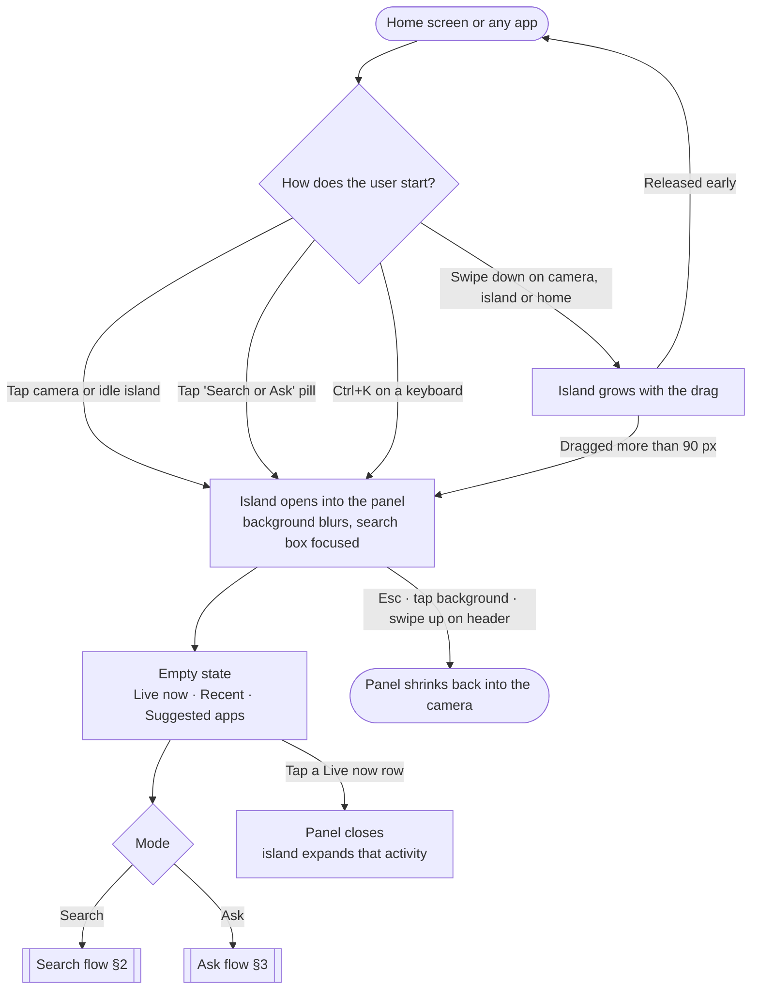
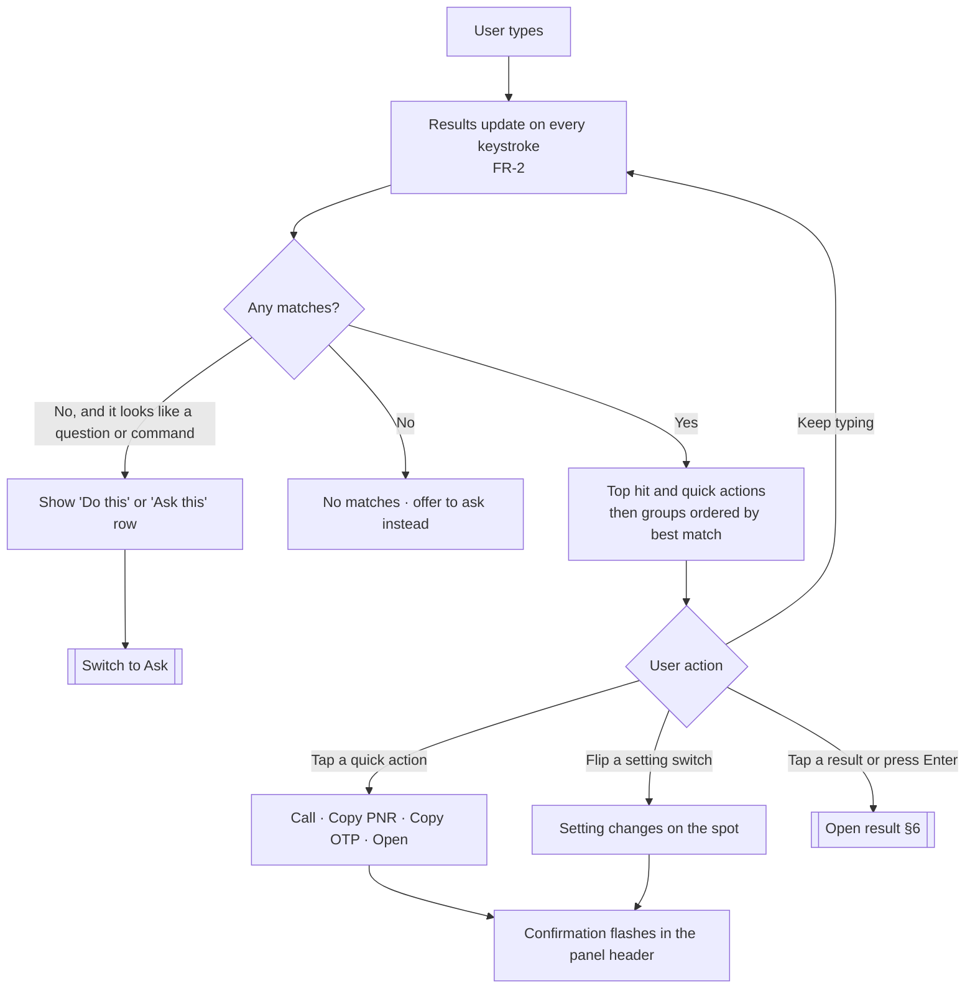
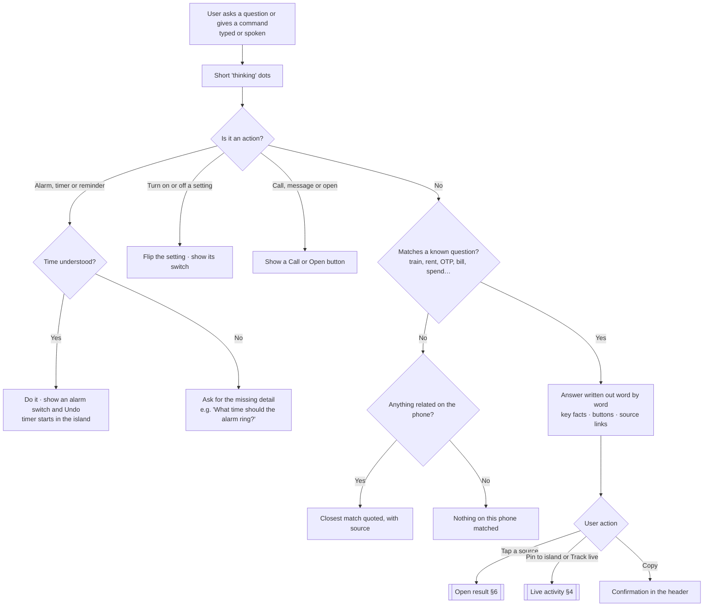
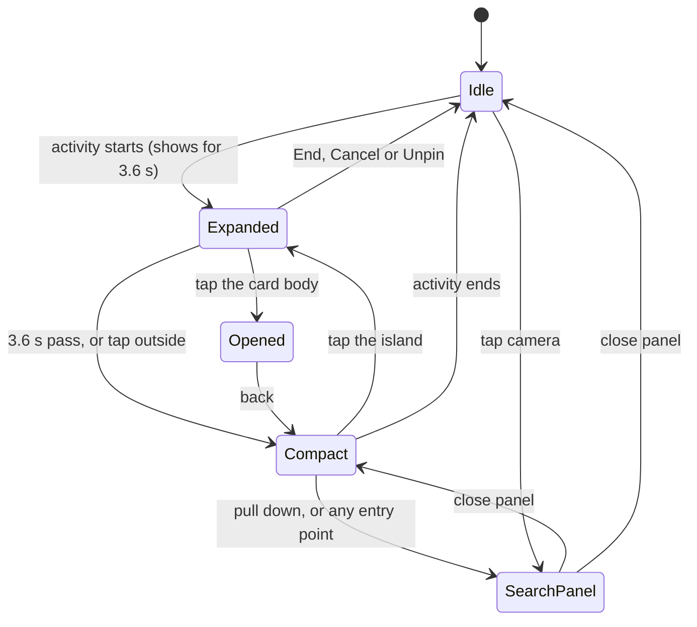
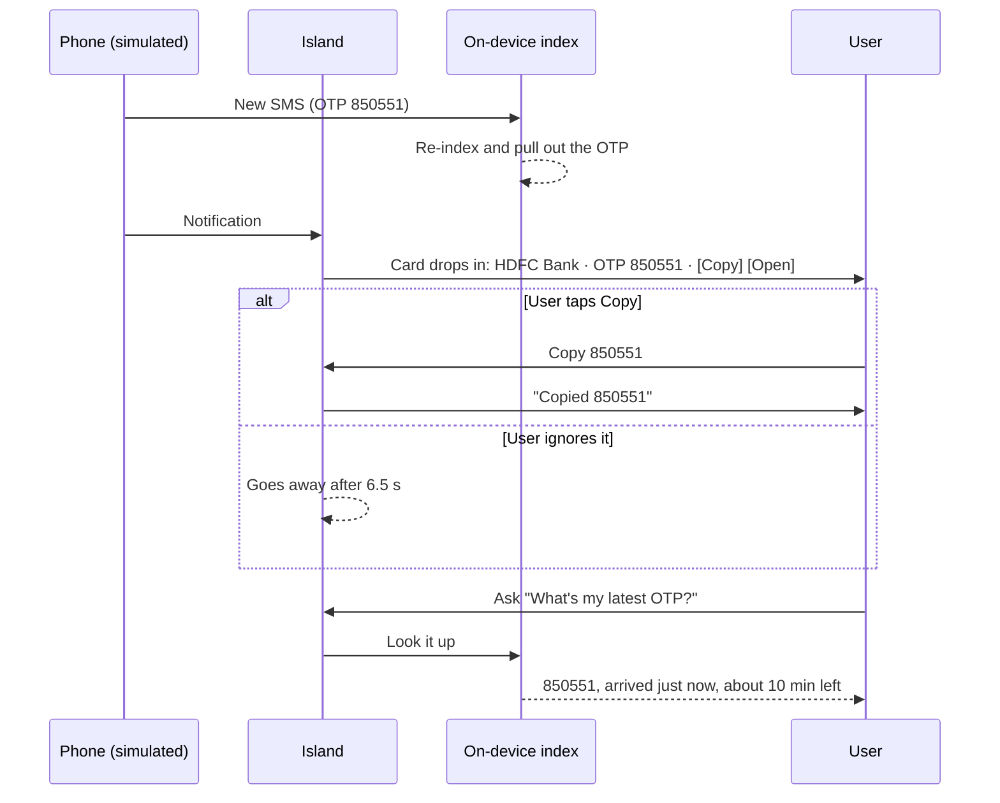
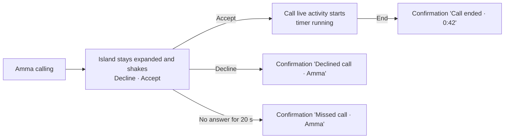
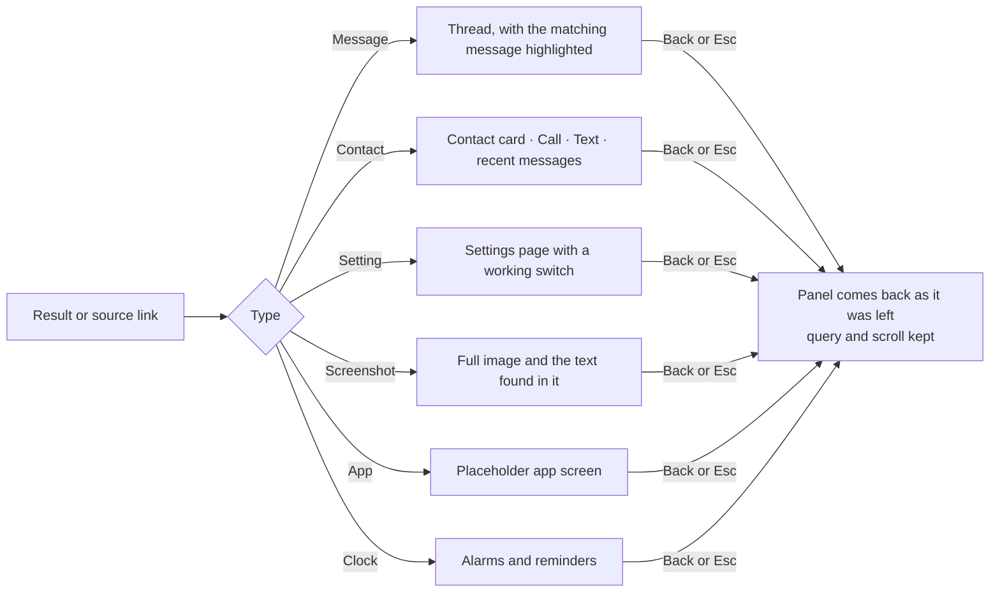

# User flows: Search or Ask

This document shows how people move through **Search or Ask**, as built in [`search-or-ask.html`](../search-or-ask.html). Requirement IDs (FR-x) and user stories (US-x) refer to the [PRD](PRD.md).

The diagrams are written in Mermaid, which GitHub draws automatically.

---

## 1. Entry points → panel

Every entry point ends in the same place: the island opens into the Search / Ask panel. If a live activity is showing, the panel grows out of that pill. If not, it grows out of the camera.

| Step | What the user sees | Notes |
|---|---|---|
| Open | Black panel grows out of the camera and springs to size | Status bar hides behind it |
| Header | Search / Ask toggle left of the camera, "On-device" right of it | Tab switches mode |
| Empty state | Live activities, recent searches, suggested apps | In Ask mode: sample questions |

---

## 2. Search flow

**How matching works:**
1. Exact word → prefix → digits inside a number → typo within 1–2 edits (FR-3).
2. If a word is missing, related words count as a weaker match (FR-4).
3. A per-type weight and a recency boost are applied. PNR and OTP queries push up messages that contain one (FR-7).

### Example: "Where's my ticket?" (US-1)
| # | User | System |
|---|---|---|
| 1 | Pulls the island down | Panel opens, search box focused |
| 2 | Types `pnr` | Top hit: IRCTC SMS with PNR 4521876390, plus **Copy PNR** |
| 3 | Taps **Copy PNR** | Header flashes "Copied 4521876390" |
| 4 | Taps the top hit | SMS thread opens with that message highlighted |

### Example: a setting in your own words (US-2)
| Query | Top hit | Why it matched |
|---|---|---|
| `night theme` | Dark theme | Synonym list |
| `bluetoth` | Bluetooth | 1 edit away (letters swapped) |
| `make text bigger` | Font size | Synonym "bigger text" |

---

## 3. Ask flow

### Example: "What's my latest OTP?" (US-3)
| # | User | System |
|---|---|---|
| 1 | Taps **Ask**, types the question | Answer: "Your latest OTP is **482913** from HDFC Bank for a ₹2,450 payment at Swiggy. It arrived 9 minutes ago and expires in about **1 min**." |
| 2 | — | Lists the last 3 OTPs, with source links |
| 3 | Taps **Copy 482913** | "Copied 482913" |

### Example: "Set an alarm for 8am" (US-6)
| Input | Result |
|---|---|
| `set a alarm for 8am` | "Alarm set for **8:00 AM** tomorrow, 22 h 19 min from now." Shows a switch and Undo |
| `alarm at 7` | Set for 7:00 PM today, and says why: "I took that as 7:00 PM. Add 'am' or 'pm' to change it." |
| `wake me up at 6:30 tomorrow` | 6:30 AM tomorrow ("wake me up" is always taken as morning) |
| `set an alarm` | Asks: "What time should the alarm ring?" |
| `cancel my alarms` | Turns off every alarm that's on and lists them |

---

## 4. Live activity lifecycle (Dynamic Island)

**Two activities at once:** the higher-priority one takes the pill and the other shows as a bubble. Tapping the bubble swaps them (FR-15, FR-16).

| Activity | Compact shows | Expanded controls | How it ends |
|---|---|---|---|
| Timer | Orange countdown | Pause / Resume, Cancel, progress | At 0:00 an alert shakes the island, with "+1 min" and Stop |
| Call | Duration and a sound wave | Mute, Speaker, End | End button, here or on the call screen |
| Swiggy order | Stage and minutes left | Progress bar with a moving scooter | Delivered notification |
| Train trip | Coach · seat and days to go | Route, berth, Copy PNR, Unpin | Unpin |
| Voice input | — | Live transcript | Transcript fills the search box |

---

## 5. Incoming events

### Incoming call (US-9)

---

## 6. Open a result and come back

While a result is open, the panel hides and the island goes back to showing live activities.

---

## 7. Demo script (about 3 minutes)

The Developer panel beside the phone drives this.

1. **Search:** click `pnr`, then `night theme`, then `bluetoth`. This shows ranking, synonyms and typo tolerance.
2. **Ask:** click "When is my train?", then **Pin to island**. The trip appears in the island.
3. **Action:** "Set an alarm for 8am", then "Set a timer for 10 minutes". The timer takes the pill and the train moves to the bubble.
4. **Live event:** click **Incoming OTP**. A card drops in. Ask "What's my latest OTP?" and it returns the new code.
5. **Call:** click **Amma calls**, accept, then end it from the island.
6. **Reset** to return to the starting state.
